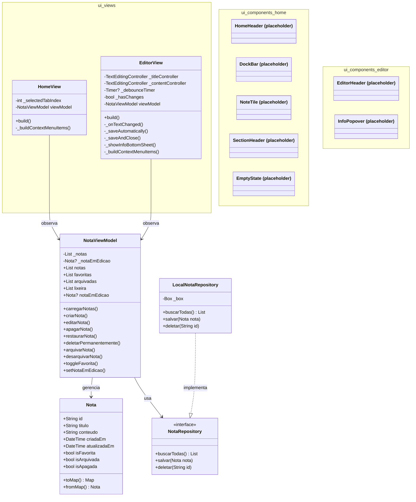

# Anotai

Um app de anotações offline-first construído com Flutter como projeto de aprendizado prático.

## Sobre

Anotai é um exercício pedagógico: um app real sendo desenvolvido do zero com foco em
arquitetura de software, boas práticas e versionamento com Git.

## Status

**MVP completo** — todas as funcionalidades principais estão implementadas e funcionais.

## Funcionalidades (MVP)

✅ **Criação e edição**
- Criação de notas com título e conteúdo
- Edição em tempo real com salvamento automático (5 segundos de debounce)
- Salvamento imediato ao fechar a nota

✅ **Organização**
- Arquivamento de notas em pasta dedicada
- Desarquivamento com volta automática à aba original
- Marcação de notas como favoritas

✅ **Lixeira**
- Exclusão soft (move para lixeira, não deleta de verdade)
- Permanece por tempo indeterminado (futura implementação de countdown 30 dias)
- Restauração mantém estado anterior (se era arquivada, volta ao arquivo)
- Exclusão permanente com um clique

✅ **Interface**
- Três abas: Anotações, Arquivo, Lixeira
- Menu de contexto dinâmico por aba
- Botão de informações com data de criação (DD-MM-AAAA)
- Indicador visual de favoritas (estrela)

**Planejado para o futuro (Fase 2+)**
- Busca por título ou conteúdo
- Aba dedicada para favoritas
- Lock/unlock de notas (modo read-only)
- Histórico de versões (reverter para estado anterior)
- Suporte a imagens nas anotações
- Plataforma Android
- Sincronização entre dispositivos

## Tech Stack

- **Flutter / Dart** — framework UI multiplataforma
- **Hive** — banco de dados local NoSQL, otimizado para Flutter
- **Provider** — gerenciamento de estado (ChangeNotifier)

## Arquitetura

Padrão **MVVM** (Model-View-ViewModel), com camadas bem definidas:

```
lib/
├── models/         # Nota: classe de dados com serialização
├── repositories/   # NotaRepository (interface) + LocalNotaRepository (Hive)
├── viewmodels/     # NotaViewModel: lógica de estado, ChangeNotifier
├── ui/             # Tudo relacionado à interface
│   ├── views/      # HomeView, EditorView: orquestram a tela
│   ├── components/ # Widgets reutilizáveis (home/ e editor/)
│   ├── styles/     # AppTheme: tokens de design centralizados
│   └── utils/      # Funções auxiliares puras (formatadores, etc.)
└── main.dart       # Inicialização (Hive, Provider, app raiz)
```

### Padrões utilizados

- **Repository Pattern** — abstração entre lógica e persistência
- **Soft Delete** — exclusão lógica com flag `isApagada` (futuro: countdown 30 dias)
- **Change Notifier** — reatividade: Views escutam mudanças no ViewModel
- **Debounce** — salvamento automático após 5s de inatividade
- **Injeção de Dependência** — ViewModel recebe Repository no construtor

### Estados da Nota

Uma nota tem três estados **independentes**:
- `isFavorita`: marca como favorita (estrela)
- `isArquivada`: marca como arquivada (aba "Arquivo")
- `isApagada`: marca como deletada (aba "Lixeira")

Exemplo: uma nota pode estar `isArquivada=true` e depois ser `isApagada=true`.
Ao restaurar da lixeira, volta com `isArquivada=true` (lembra do estado anterior).

## Como rodar localmente

**Pré-requisitos**
- [Flutter SDK](https://docs.flutter.dev/get-started/install) (versão 3.12+)
- Google Chrome (para rodar no web)

**Instalação**
```bash
git clone https://github.com/rogial12/anotai.git
cd anotai
flutter pub get
flutter run -d chrome
```

**Estrutura do projeto**
```
anotai/
├── lib/
│   ├── models/nota.dart              # Modelo com toMap/fromMap
│   ├── repositories/
│   │   ├── nota_repository.dart      # Interface (contrato)
│   │   └── local_nota_repository.dart # Implementação Hive
│   ├── viewmodels/nota_viewmodel.dart # Lógica + estado reativo
│   ├── ui/
│   │   ├── views/
│   │   │   ├── home_view.dart        # Tela principal (3 abas)
│   │   │   └── editor_view.dart      # Tela de criação/edição
│   │   ├── components/
│   │   │   ├── home/                 # NoteTile, DockBar, HomeHeader, etc.
│   │   │   └── editor/               # EditorHeader, InfoPopover
│   │   ├── styles/app_theme.dart     # Tokens de design (cores, tipografia, etc.)
│   │   └── utils/formatters.dart     # Funções auxiliares puras
│   └── main.dart                     # Entry point
├── pubspec.yaml                      # Dependências (hive, provider)
├── docs/diagrama.md                  # Diagrama de classes (Mermaid)
└── README.md                         # Este arquivo
```

**Diagrama de classes do projeto**

# Diagrama de Classes — Anotai

Arquitetura MVVM implementada no MVP.



## Mudanças principais (MVP)

### Modelo Nota
- **Removido:** `DateTime? apagadaEm`
- **Adicionado:** `bool isApagada` (soft delete com countdown 30 dias)
- **Estados:** Agora são independentes (`isFavorita`, `isArquivada`, `isApagada`)
- **Serialização:** `toMap()` e `fromMap()` para persistência Hive

### ViewModel
- **Novo:** `_notaEmEdicao` — rastreia nota em edição
- **Novos métodos:** `desarquivarNota()`, `deletarPermanentemente()`, `setNotaEmEdicao()`
- **Refatorado:** `restaurarNota()` — mantém estado `isArquivada` ao restaurar
- **Refatorado:** getters filtrados agora usam `isApagada` em lugar de `apagadaEm`

### Views
- **HomeView:** Menu dinâmico por aba, `PopupMenuButton` para posicionamento correto
- **EditorView:** Envolvida em `Consumer` para escutar mudanças, botão favorita funcional, bottom sheet de informações


## Roadmap detalhado

| Fase | Feature | Status |
|------|---------|--------|
| **Fase 2** | Busca por título/conteúdo | ⏳ Planejado |
| | Aba dedicada "Favoritas" | ⏳ Planejado |
| | Diálogo de confirmação + Undo de exclusão | ⏳ Planejado |
| | Countdown de 30 dias na lixeira | ⏳ Planejado |
| | Melhorias na UI — linguagem de design consistente | ⏳ Planejado |
| | Contagem de caracteres/palavras na edição | ⏳ Planejado |
| **Fase 3** | Lock/unlock (modo read-only) | ⏳ Planejado |
| | Histórico de versões (reverter estado) | ⏳ Planejado |
| | Suporte a imagens nas anotações | ⏳ Planejado |
| | Tags/categorias | ⏳ Planejado |
| | Anotações criptografadas | ⏳ Planejado |
| | Exportação/backup manual | ⏳ Planejado |
| | Modo escuro (dark mode) | ⏳ Planejado |
| **Fase 4** | App Android nativo | ⏳ Planejado |
| | Autenticação biométrica (digital/face) | ⏳ Planejado |
| | Sincronização entre dispositivos | ⏳ Planejado |
| | Offline-first com sync | ⏳ Planejado |
| | Resolução de conflitos de sincronização | ⏳ Planejado |

### Notas sobre o Roadmap

- **Fase 2** foca em polimento do MVP (UX, busca, confirmações)
- **Fase 3** adiciona features avançadas (histórico, criptografia, tags)
- **Fase 4** expande para multiplataforma com sincronização
- Todas as fases mantêm compatibilidade com versões anteriores

## Notas de desenvolvimento

- Commits direto na `main` durante MVP (migrar para feature branches + PRs na Fase 2)
- Todos os métodos têm comentários explicativos (educacional)
- Estado reativo via `Consumer<NotaViewModel>` — View não precisa saber de persistência
- Testes ainda não implementados (foco em funcionalidade + aprendizado)
