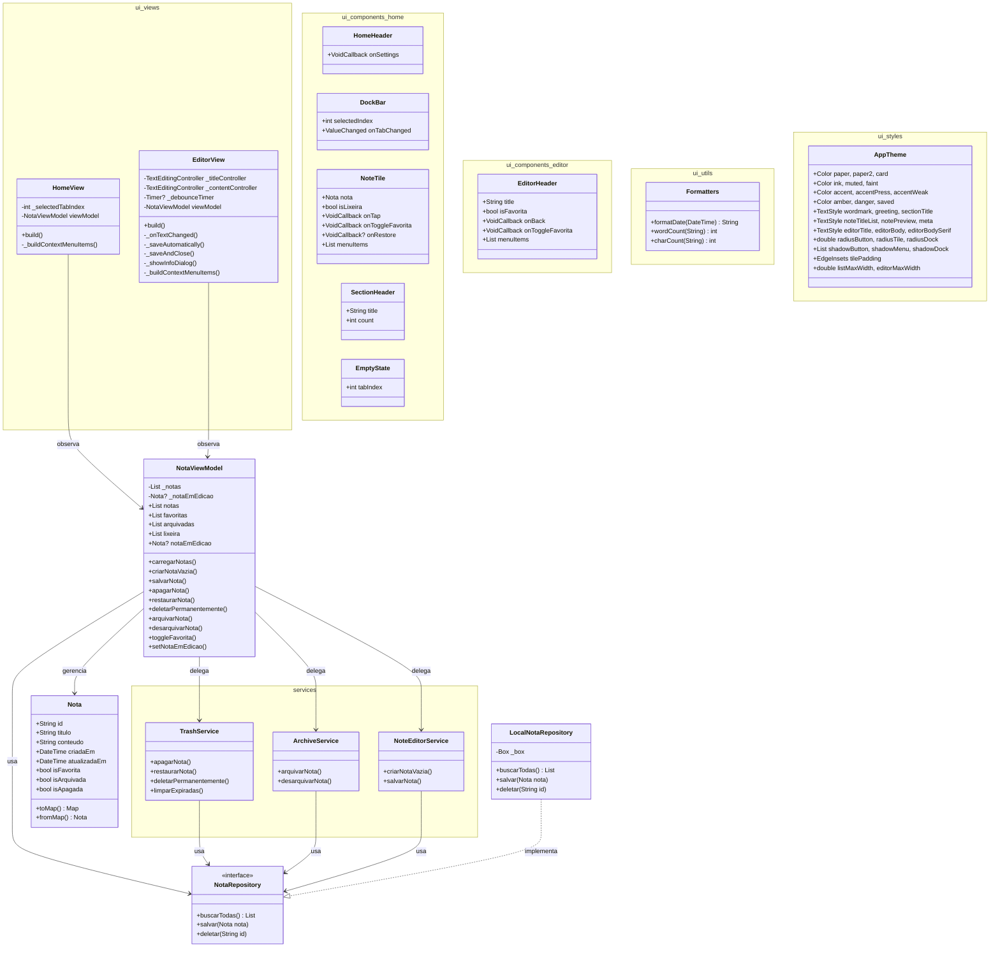

# Diagrama de Classes — Anotai

Arquitetura MVVM implementada no MVP.

## Histórico de mudanças

### Modelo Nota
- **Removido:** `DateTime? apagadaEm`
- **Adicionado:** `bool isApagada` (soft delete com countdown 30 dias)
- **Estados:** Agora são independentes (`isFavorita`, `isArquivada`, `isApagada`)
- **Serialização:** `toMap()` e `fromMap()` para persistência Hive

### ViewModel
- **Novo:** `_notaEmEdicao` — rastreia nota em edição
- **Novo:** `criarNotaVazia()` — cria nota vazia ao abrir editor (padrão "sempre editando")
- **Novo:** `salvarNota()` — substitui `criarNota` + `editarNota`, sem distinção criar/editar
- **Removidos:** `criarNota()` e `editarNota()` — lógica migrada para `NoteEditorService`
- **Refatorado:** `restaurarNota()` — mantém estado `isArquivada` ao restaurar
- **Refatorado:** getters filtrados excluem notas vazias (título e conteúdo em branco)

### Views
- **HomeView:** FAB chama `criarNotaVazia()` antes de navegar para o editor
- **EditorView:** `_saveAutomatically()` simplificado para uma chamada a `salvarNota()`; `_hasChanges` removido

### Camada Services (implementada)
- **`TrashService`**: `apagarNota`, `restaurarNota`, `deletarPermanentemente` + `limparExpiradas` (TODO — expiração de 30 dias)
- **`ArchiveService`**: `arquivarNota`, `desarquivarNota`
- **`NoteEditorService`**: `criarNotaVazia`, `salvarNota`
- Todos os serviços recebem `NotaRepository` via injeção de dependência e são instanciados em `main.dart`
