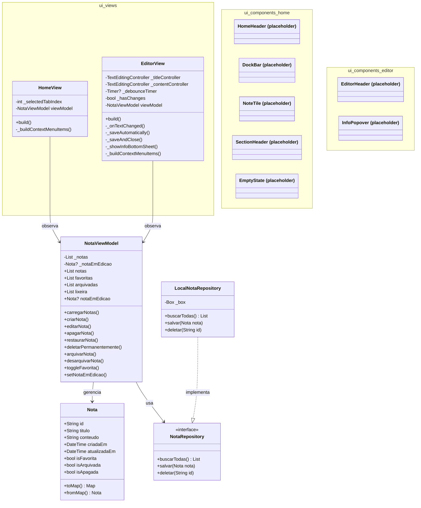

# Diagrama de Classes — Anotai

Arquitetura MVVM implementada no MVP.

## Mudanças principais (MVP)

### Modelo Nota
- **Removido:** `DateTime? apagadaEm`
- **Adicionado:** `bool isApagada` (soft delete com countdown 30 dias)
- **Estados:** Agora são independentes (`isFavorita`, `isArquivada`, `isApagada`)
- **Serialização:** `toMap()` e `fromMap()` para persistência Hive

### ViewModel
- **Novo:** `_notaEmEdicao` — rastreia nota em edição
- **Novos métodos:** `desarquivarNota()`, `deletarPermanentemente()`, `setNotaEmEdicao()`
- **Refatorado:** `restaurarNota()` — mantém estado `isArquivada` ao restaurar
- **Refatorado:** getters filtrados agora usam `isApagada` em lugar de `apagadaEm`

### Views
- **HomeView:** Menu dinâmico por aba, `PopupMenuButton` para posicionamento correto
- **EditorView:** Envolvida em `Consumer` para escutar mudanças, botão favorita funcional, bottom sheet de informações
