# Diagrama de Classes — Anotai

Arquitetura MVVM implementada no MVP.

```mermaid
classDiagram
    class Nota {
        +String id
        +String titulo
        +String conteudo
        +DateTime criadaEm
        +DateTime atualizadaEm
        +bool isFavorita
        +bool isArquivada
        +bool isApagada
        +DateTime? apagadaEm
        +List categoriaIds
        +toMap() Map
        +fromMap() Nota
    }

    class Categoria {
        +String id
        +String nome
        +toMap() Map
        +fromMap() Categoria
    }

    class NotaViewModel {
        -List _notas
        -Nota? _notaEmEdicao
        -String _searchQuery
        +List notas
        +List favoritas
        +List arquivadas
        +List lixeira
        +Nota? notaEmEdicao
        +String searchQuery
        +carregarNotas()
        +criarNotaVazia()
        +salvarNota()
        +apagarNota()
        +restaurarNota()
        +deletarPermanentemente()
        +arquivarNota()
        +desarquivarNota()
        +toggleFavorita()
        +setNotaEmEdicao()
        +setSearchQuery()
        +atualizarCategorias()
        +removerCategoriaDasNotas()
    }

    class NotaRepository {
        <<interface>>
        +buscarTodas() List
        +salvar(Nota nota)
        +deletar(String id)
    }

    class LocalNotaRepository {
        -Box _box
        +buscarTodas() List
        +salvar(Nota nota)
        +deletar(String id)
    }

    class CategoriaRepository {
        <<interface>>
        +buscarTodas() List
        +salvar(Categoria categoria)
        +deletar(String id)
    }

    class LocalCategoriaRepository {
        -Box _box
        +buscarTodas() List
        +salvar(Categoria categoria)
        +deletar(String id)
    }

    namespace ui_views {
        class HomeView {
            -int _selectedTabIndex
            -Set _selectedChips
            -List _categorias
            +build()
            -_filtrarPorChips()
            -_onChipTapped()
            -_carregarCategorias()
            -_showGerenciarCategoriasDialog()
            -_showChipLongPressMenu()
            -_buildContextMenuItems()
        }

        class EditorView {
            -TextEditingController _titleController
            -TextEditingController _contentController
            -Timer? _debounceTimer
            +build()
            -_onTextChanged()
            -_saveAutomatically()
            -_saveAndClose()
            -_showInfoDialog()
            -_showCategoriasDialog()
            -_buildContextMenuItems()
        }
    }

    namespace ui_components_home {
        class HomeHeader {
            +VoidCallback onSettings
            +TextEditingController searchController
            +ValueChanged onSearchChanged
            -bool _isSearching
            -FocusNode _searchFocus
        }
        class DockBar {
            +int selectedIndex
            +ValueChanged onTabChanged
        }
        class NoteTile {
            +Nota nota
            +bool isLixeira
            +VoidCallback onTap
            +VoidCallback onToggleFavorita
            +VoidCallback? onRestore
            +List menuItems
        }
        class SectionHeader {
            +String title
            +int count
        }
        class EmptyState {
            +int tabIndex
        }
        class ChipBar {
            +Set selectedChips
            +ValueChanged onChipTapped
            +List categorias
            +VoidCallback? onAddTapped
            +ValueChanged? onChipLongPressed
        }
        class GerenciarCategoriasDialog {
            +List categorias
            +Function onCriar
            +Function onRenomear
            +Function onExcluir
        }
        class RenomearCategoriaDialog {
            +Categoria categoria
            +Function onRenomear
        }
    }

    namespace ui_components_editor {
        class EditorHeader {
            +String title
            +bool isFavorita
            +VoidCallback onBack
            +VoidCallback onToggleFavorita
            +VoidCallback? onCategoriaTapped
            +List menuItems
        }
        class CategoriasDialog {
            +Nota nota
            +List categorias
            +Function onSalvar
        }
    }

    namespace ui_utils {
        class Formatters {
            +formatDate(DateTime) String
            +wordCount(String) int
            +charCount(String) int
        }
    }

    namespace ui_styles {
        class AppTheme {
            +Color paper, paper2, card
            +Color ink, muted, faint
            +Color accent, accentPress, accentWeak
            +Color amber, danger, saved
            +TextStyle wordmark, greeting, sectionTitle
            +TextStyle noteTitleList, notePreview, meta
            +TextStyle editorTitle, editorBody, editorBodySerif
            +double radiusButton, radiusTile, radiusDock
            +List shadowButton, shadowMenu, shadowDock
            +EdgeInsets tilePadding
            +double listMaxWidth, editorMaxWidth
        }
    }

    namespace services {
        class FavoriteService {
            +toggleFavorita()
        }
        class SearchService {
            +buscar(List notas, String query) List
        }
        class TrashService {
            +apagarNota()
            +restaurarNota()
            +deletarPermanentemente()
            +limparExpiradas(List notas) List
        }
        class ArchiveService {
            +arquivarNota()
            +desarquivarNota()
        }
        class NoteEditorService {
            +criarNotaVazia()
            +salvarNota()
        }
        class CategoriaService {
            +buscarTodas() List
            +criar(String nome) Categoria
            +renomear(Categoria categoria, String novoNome)
            +deletar(String id)
        }
    }

    NotaViewModel --> NotaRepository : usa
    NotaViewModel --> FavoriteService : delega
    NotaViewModel --> SearchService : delega
    NotaViewModel --> TrashService : delega
    NotaViewModel --> ArchiveService : delega
    NotaViewModel --> NoteEditorService : delega
    FavoriteService --> NotaRepository : usa
    TrashService --> NotaRepository : usa
    ArchiveService --> NotaRepository : usa
    NoteEditorService --> NotaRepository : usa
    LocalNotaRepository ..|> NotaRepository : implementa
    CategoriaService --> CategoriaRepository : usa
    LocalCategoriaRepository ..|> CategoriaRepository : implementa
    HomeView --> NotaViewModel : observa
    HomeView --> CategoriaService : carrega categorias
    HomeView --> ChipBar : renderiza
    HomeView --> GerenciarCategoriasDialog : abre
    HomeView --> RenomearCategoriaDialog : abre (long press)
    EditorView --> NotaViewModel : observa
    EditorView --> CategoriaService : carrega categorias
    EditorView --> CategoriasDialog : abre
    NotaViewModel --> Nota : gerencia
    Nota --> Categoria : referencia via categoriaIds
```

## Histórico de mudanças

### Modelo Nota
- **Adicionado:** `bool isApagada` (soft delete)
- **Adicionado:** `DateTime? apagadaEm` (timestamp de entrada na lixeira; `null` = fora da lixeira; usado por `limparExpiradas` para expiração de 30 dias)
- **Estados:** Independentes (`isFavorita`, `isArquivada`, `isApagada`)
- **Serialização:** `toMap()` e `fromMap()` para persistência Hive

### ViewModel
- **Novo:** `_notaEmEdicao` — rastreia nota em edição
- **Novo:** `criarNotaVazia()` — cria nota vazia ao abrir editor (padrão "sempre editando")
- **Novo:** `salvarNota()` — substitui `criarNota` + `editarNota`, sem distinção criar/editar
- **Removidos:** `criarNota()` e `editarNota()` — lógica migrada para `NoteEditorService`
- **Refatorado:** `restaurarNota()` — mantém estado `isArquivada` ao restaurar
- **Refatorado:** getters filtrados excluem notas vazias (título e conteúdo em branco)

### Views
- **HomeView:** FAB chama `criarNotaVazia()` antes de navegar para o editor
- **EditorView:** `_saveAutomatically()` simplificado para uma chamada a `salvarNota()`; `_hasChanges` removido

### Camada Services (implementada)
- **`TrashService`**: `apagarNota`, `restaurarNota`, `deletarPermanentemente`, `limparExpiradas` (exclui permanentemente notas com mais de 30 dias na lixeira; chamado no `carregarNotas`)
- **`ArchiveService`**: `arquivarNota`, `desarquivarNota`
- **`NoteEditorService`**: `criarNotaVazia`, `salvarNota`
- **`FavoriteService`**: `toggleFavorita`
- **`SearchService`**: `buscar` (stateless, sem repositório — filtra lista em memória)
- Todos os serviços recebem `NotaRepository` via injeção de dependência e são instanciados em `main.dart`

### Categorias (Passo 1 — ajuste arquitetural)
- **Novo modelo:** `Categoria { id, nome }` com `toMap`/`fromMap`
- **Nova interface:** `CategoriaRepository` (mesmo contrato do `NotaRepository`)
- **Nova implementação:** `LocalCategoriaRepository` (Hive, box `'categorias'`)
- **Novo serviço:** `CategoriaService` — `criar`, `renomear`, `deletar`, `buscarTodas`; não gerencia associação nota↔categoria (responsabilidade do ViewModel)
- **`Nota` atualizada:** novo campo `List<String> categoriaIds` (padrão `[]`; compatível com notas antigas via `?? []` no `fromMap`)
- **`main.dart`:** `ChangeNotifierProvider` substituído por `MultiProvider`; `CategoriaService` disponível na árvore via `Provider<CategoriaService>`
- **Decisão de design:** categorias armazenadas por ID nas notas (não por nome) — renomear uma categoria não exige atualizar nenhuma nota

### Categorias (Passos 2–3 — chips de filtro)
- **Novo componente:** `ChipBar` — barra horizontal com chips "Todos", "Favoritas", categorias personalizadas e "+"
- **Chips fixas:** "Todos" (desativa filtros) e "Favoritas" sempre aparecem; não têm long press
- **Multi-seleção AND:** selecionar múltiplas chips exige que a nota satisfaça todas as condições simultaneamente
- **Filtro isolado por aba:** `_filtrarPorChips` aplicado às listas `notas` e `arquivadas`; lixeira não exibe chips
- **Reset automático:** chips voltam para "Todos" ao trocar de aba

### Categorias (Passo 4 — associação na EditorView)
- **`EditorHeader` atualizado:** novo botão de categorias (`Icons.sell_outlined`) visível apenas quando há nota salva
- **Novo componente:** `CategoriasDialog` — dialog com lista de checkboxes por categoria; mudanças só propagam ao confirmar ("Salvar")
- **`NotaViewModel.atualizarCategorias()`:** persiste a nova lista de IDs na nota

### Categorias (Passos 5–6 — gerenciamento completo)
- **Novo componente:** `GerenciarCategoriasDialog` — hub acessível pelo chip "+"; lista existentes com botões de editar/excluir + campo inline para criar nova categoria
- **Novo componente:** `RenomearCategoriaDialog` — igual ao dialog de criação, mas pré-preenchido; "Salvar" habilitado apenas quando o nome de fato mudou
- **Long press nas chips:** abre bottom sheet com ações "Renomear" e "Excluir" para a categoria específica
- **`NotaViewModel.removerCategoriaDasNotas()`:** ao excluir uma categoria, percorre todas as notas e remove o ID órfão (O(n), aceitável para operação rara)
