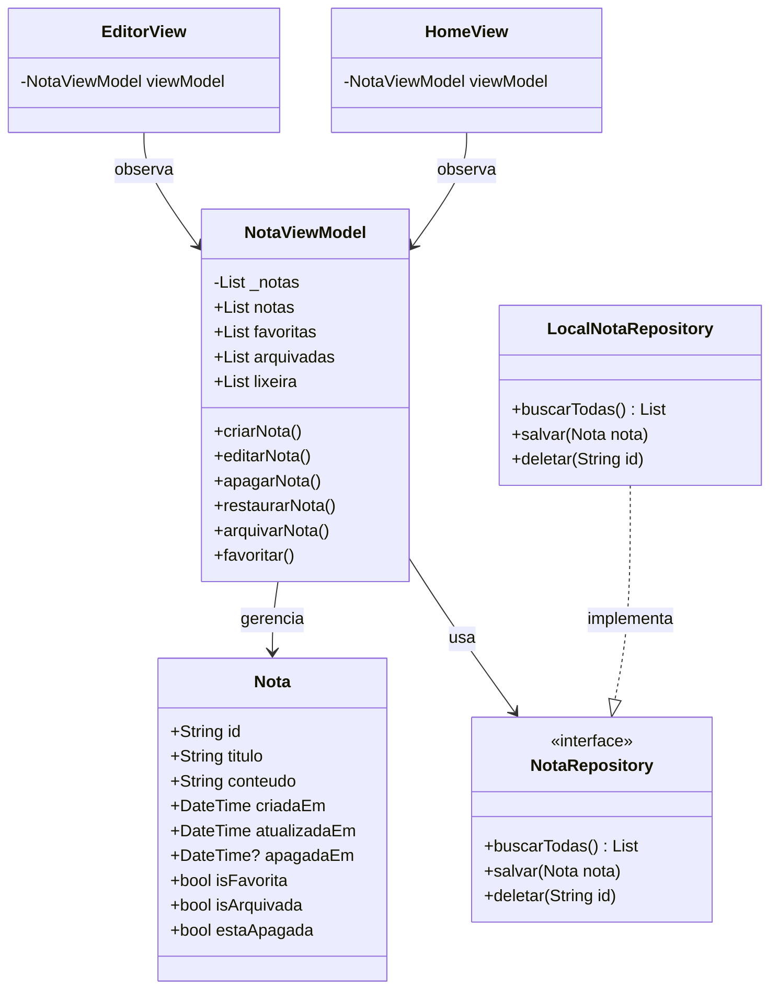

# Diagrama de Classes — Anotai

Arquitetura MVVM planejada para o MVP.

```mermaid
classDiagram
    class Nota {
        +String id
        +String titulo
        +String conteudo
        +DateTime criadaEm
        +DateTime atualizadaEm
        +DateTime? apagadaEm
        +bool isFavorita
        +bool isArquivada
        +bool estaApagada
    }

    class NotaViewModel {
        -List _notas
        +List notas
        +List favoritas
        +List arquivadas
        +List lixeira
        +criarNota()
        +editarNota()
        +apagarNota()
        +restaurarNota()
        +arquivarNota()
        +favoritar()
    }

    class NotaRepository {
        <<interface>>
        +buscarTodas() List
        +salvar(Nota nota)
        +deletar(String id)
    }

    class LocalNotaRepository {
        +buscarTodas() List
        +salvar(Nota nota)
        +deletar(String id)
    }

    class HomeView {
        -NotaViewModel viewModel
    }

    class EditorView {
        -NotaViewModel viewModel
    }

    NotaViewModel --> NotaRepository : usa
    LocalNotaRepository ..|> NotaRepository : implementa
    HomeView --> NotaViewModel : observa
    EditorView --> NotaViewModel : observa
    NotaViewModel --> Nota : gerencia
```
